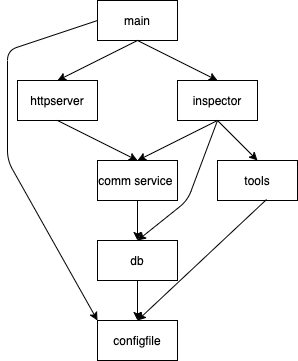

## 简介
wire 是一个golang的服务管理框架，负责业务程序内的模块依赖管理和启停管理。

## 问题
任何一个程序在业务开始复杂后，都回切分成不同的功能¡模块，不同的模块之间存在依赖关系。 在golang 中，每个go文件的顶部 `import` 部分 表明了该模块的依赖列表。 
典型的一个业务的服务调用依赖如图:



在这个服务中： 
* `main`模块启动的时候调用2个业务功能模块, 一个是`httpserver` ，一个是巡检程序 `inspector`, 同时会读取命令行参数和 `configfile`模块 ， 根据参数，控制行为。
* `httpsever` 依赖`common service`一些公共的业务逻辑模块。 接受业务http请求，调用服务
* `common service` 依赖 `db` 模块读写数据。
* `db` 模块依赖`configfile` 获得DB的连接地址等参数
* `inspector` 模块调用 `common service` 和一些其他依赖工具 `tools`,比如，外部服务。 
* `tools` 也依赖 `configfile` 配置自己要调用的外部服务的访问地址与配置。

在这个调用模型中， `main` 模块启动两个服务，每个服务要能按照顺序初始化自身的所有依赖。 
比如:对于 `inspector`, 他的 `Start`方法要做: 
```
package inspector
func Start() error {
    configfile.init()
    db.init()
    common_service.init()
    tools.init()
    inpsector.start()
}
```

对于 `httpserver` 需要写同样的逻辑。 业务开发需要能做到： 

1. 业务服务要了解自身依赖以及依赖模块的依赖。手动按照模块的依赖顺序初始化这些组件。
2. 对于要停止服务执行`Stop`的时候， 要能手动反方向执行各个组件的stop。 
3. 同时对于公共组件， 每个组件都要编写对应的调用初始化代码。 也同时要有能防止重复初始化的机制。
4. 每个业务服务模块 维护一大堆的对象。比如 DBEngine对象，tools外部服务连接。 每个业务都要维护类似的对象。 
5. 一旦依赖发生变化，业务功能模块也要能感知变化， 并且在初始化逻辑流程中添加新的依赖项。  

维护的成本很高。

## 解决方案

目标: 
1. 模块依赖链路能自动管理
2. 模块操作(初始化、启动、停止、变化) 都在模块内部完成。不会把相关操作留给更上游的业务。
3. 模块依赖发生变化影响当前模块，不会影响更上游模块
4. 模块间通过接口操作。

### 设计方案 
对于`wire`, 我们把每个模块都认为是一个服务`Service` 。`Service` 内部维护自身的状态. 调用该服务的上游服务，不需要关注该服务本身的初始化操作，也不需要服务的实例之类的变量，直接调用该服务提供的方法即可。

对于一个`Service` ,我们定义了一个接口类型:
```
// Service  定义服务接口要求
type Service interface {
	// 初始化服务
	Init() error
	// 启动服务
	Start() error
	// 停止服务
	Stop() error
	// Notify 发送通知消息
	Notify(Message) error
}

```

### 依赖生成
为了保证按照依赖的方式初始化模块。 每个模块需要在自身模块的init方法中通过`wire.Append()` 方法把自己添加到 `wire` 中。

```
package module1

func init() {
	svc := &service{}
    // 添加Service 对象到wire中
	wire.Append(svc)
}

type S1 struct {
}

func (s *S1) Init() error {
	fmt.Println("S1 Init ")
	return nil
}
func (s *S1) Start() error {
	fmt.Println("S1 Start ")

	return nil
}
func (s *S1) Stop() error {
	fmt.Println("S1 Stop ")
	return nil
}
func (s *S1) Notify(msg wire.Message) error {
	fmt.Println("S1 notify:", msg)
	return nil
}
```
golang 在执行时，会根据 `import` 自动调用依赖模块的 `init` 的方法， 所以`main` 模块 `init` 执行结束之后， `wire` 就自动拥有了整个项目的 线性依赖列表。
### 启动服务

在main方法中，调用 `wire.Run` ，回按照依赖的顺序： 
1. 依次调用所有的Service的`Service.Init()`
2. 依次调用所有的Service的`Service.Start()`

```
	wire.Run()
```

引用了`go-svc`模块， Run 方法`func Run(sig ...os.Signal) error` 支持传入监听信号，默认会监听 `syscall.SIGINT, syscall.SIGTERM` 两种信号。

### 停止服务
如果遇到了`kill` 或者`Ctrl-c`, wire 会按照`依赖顺序相反的次序`的依次调用`Service.Stop()`的方法。 

### 通知变更
如果运行中遇到外部事件，比如配置变更，需要能通知变更消息到各个服务。 让各个服务能更新自身配置。

调用 `wrie.Notify()` 达到通知消息的目的。

```
	msg := wire.Message{
		Key:  "NullMessage",
		Data: "change ",
	}
	wire.Notify(msg)
```

`Message` 是 Notify消息类型， 包含两个变量：Key: 消息类型, Data: 消息内容。

`wrie.Notify()`  会依次按照依赖的顺序，把这个消息通知所有Service。 每个Service 需要能自己根据`Key` 过滤自己不关注的消息类型。这样就完成了 消息的广播。


### BaseService 

有些模块仅仅是功能模块，比如`db`模块，只需要`Init`初始化自身连接池、`Stop` 完成DB连接池的释放，不需要`Start` 或者`Notify` 这些动作。 用了方便用户能快速编写服务, `wire` 内部存在一个基础类型 `BaseService`实现了 `wire.Service`的接口，但是也没做什么事情。用户用户来说，可以基于 `BaseService` 实现自己的服务，减少代码数量。 

```
func init() {
	s1 := &S1{}
	wire.Append(s1)
}

type S1 struct {
	wire.BaseService
}
// S1仅仅实现了 Init 方法， 但是因为组合了 wire.BaseService ， 所以依然是可以通过wire.Append 添加到依赖队列中。 
func (s *S1) Init() error {
	fmt.Println("S1 Init ")
	return nil
}
```

## 总结

通过`wire` 模块，
1. 可以动态生成依赖列表，并且用户可以按照顺序控制所有服务的启停。 
2. 每个模块内部是需要实现自身模块的启停， 不用关注依赖模块的启停。
3. 每个模块只需要关注自身的直接依赖，可以直接调用依赖模块提供的能力，不用在关注依赖模块的初始化操作、实例化变量维护等操作，更不用关注二级依赖带来的复杂性。


